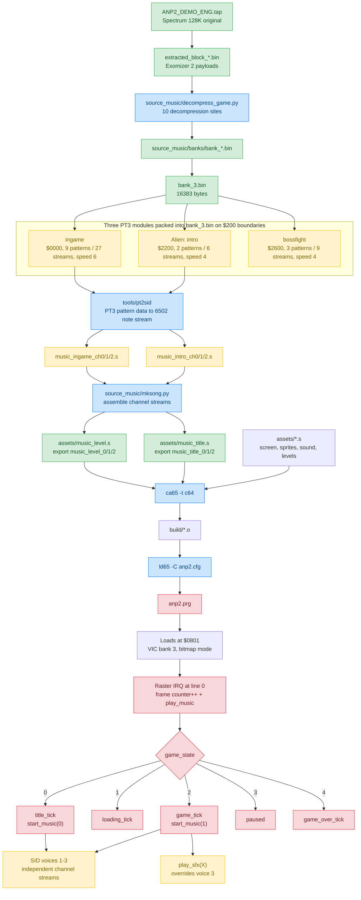

# ANP2 — Aliens: Neoplasma 2

ZX Spectrum 128K game (Sanchez Crew, n1k-o, ER) ported to the Commodore 64.

## Build

Requires `ca65`/`ld65` (cc65 V2.19), plus `cc` and `python3` for the music
pipeline.

```
make                              # -> anp2.prg (loads at $0801)
make -C source_music              # regenerate music assets from PT3
make run                          # launch in VICE, if installed
```

`anp2.prg` is committed, and a clean build reproduces it byte for byte.

## Architecture



[AGENTS.md](AGENTS.md) has the memory map, the PT3 module layout, the game
state machine and the list of known gaps.
